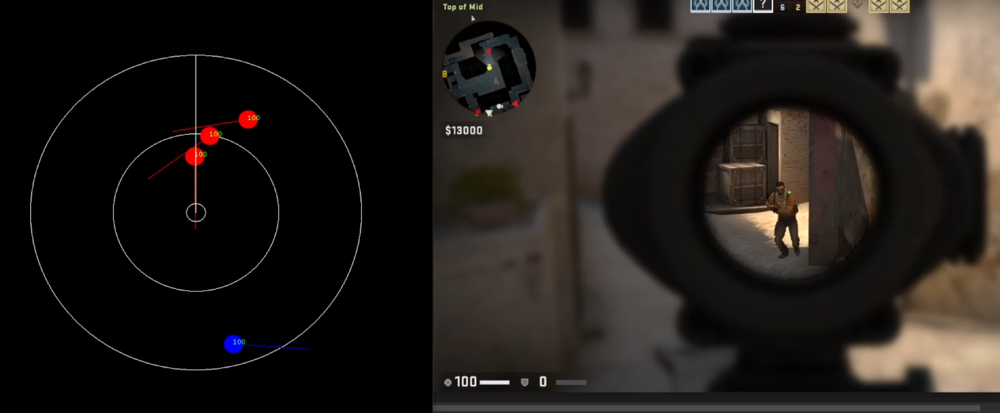
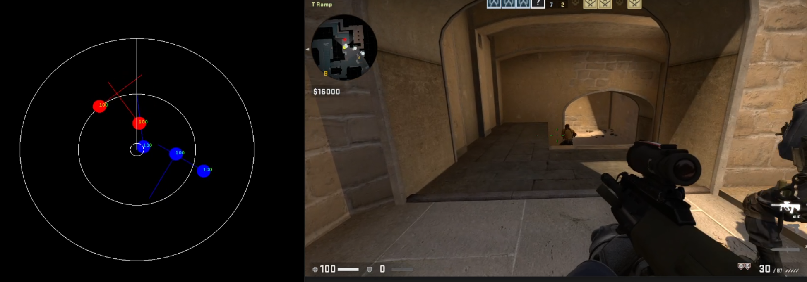
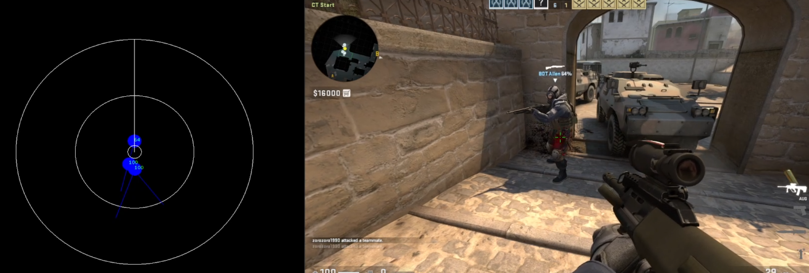
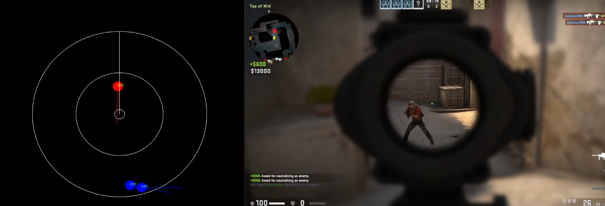

- [1. Cash Hack](#1-cash-hack)
  - [1.1. Running the hack](#11-running-the-hack)
- [2. Radar Hack](#2-radar-hack)
  - [2.1. Libraries](#21-libraries)
  - [2.2. Running the hack](#22-running-the-hack)
  - [2.3. Features](#23-features)
    - [2.3.1. Player Locations](#231-player-locations)
    - [2.3.2. Player Team](#232-player-team)
    - [2.3.3. Player Health](#233-player-health)
    - [2.3.4. Player Direction](#234-player-direction)
- [3. Field of View Hack](#3-field-of-view-hack)
  - [3.1. Running the hack](#31-running-the-hack)
  - [3.2. Limitation the hack](#32-limitation-the-hack)
- [4. AimBot Hack](#4-aimbot-hack)
  - [4.1. Running the hack](#41-running-the-hack)
  - [4.2. Limitations of the Aimbot](#42-limitations-of-the-aimbot)

# 1. Cash Hack
Simple DLL injection that reads the player's cash in 1 second intervals. Can only run this hack whilst in a game, it will crash on menus. Press END to end the thread.
## 1.1. Running the hack
Inject the DLL found in `Cash-hack/Cash-hack/Release/Dll1.dll` into the csgo process when *inside* a game.
# 2. Radar Hack
Can be found in `/RadarHack/Dll1/Dll1.sln`

Finds players within the game and displays their Location, PoV, Health and Team on a Radar
## 2.1. Libraries
The hack is using OpenGL library for the hack therefore it needs to be downloaded
```
 vcpkg install freeglut:x86-windows
```

In Visual Studio

Project > Settings > Linker > Input > Additional Dependencies
for Debug 
Add
```
opengl32.lib;glu32.lib;glut32.lib
```
<!-- opengl32.lib
freetype.lib
glu32.lib
glut32.lib -->
## 2.2. Running the hack
1. Open the game
2. Open Extreme Injector
3. Inject OpenGL library from `/RadarHack/Dll1/Debug/freeglutd.dll`
4. After this inject the hack itself from `/RadarHack/Dll1/Debug/Dll1.dll`

## 2.3. Features
### 2.3.1. Player Locations

The radar will display player locations relative to your location (as a center) and your rotation. 

Players will only be displayed within a certain range from you. Therefore if they walk away too far, they will not be displayed

### 2.3.2. Player Team

Player team will be indicated with colour of their circle
- `Blue` - Friendly player
- `Red` - Enemy player

### 2.3.3. Player Health

Each of the players on the map will have a health displayed above their location. As the players take damage the health will update with it. When health reaches 0, player is removed from the map

### 2.3.4. Player Direction

The radar is also showing direction the players are facing. The radar will display a line going from the player towards their pov, color in the same colour as the player themselves. 

# 3. Field of View Hack
Field of view hack expands the viewpoint of a player and also allow player to aim and see more of the battlefield.
press the key 'F7' to increase the viewpoint
press the key 'F8' to decrease the viewpoint
press the key 'F9' to set the viewpoint to default
## 3.1. Running the hack
inject the DLL file in `field of view/Dll1/Debug/Dll1.dll`
## 3.2. Limitation the hack
The hack can only work after the game have started

# 4. AimBot Hack
The aimbot hack has been implemented as a "dormant" bot. What this means is that the aimbot is running, but is waiting an input from the user so that it can snap to the enemy's head and shoot!
Essentially what it does it that it reads the process memory from the module handled (`client.dll`) with some offsets so that it can gain the information required such as:
1. Where the players in the game
2. What team they are on
3. What health they have
4. Is the entity dormant? I.e. has the entity been rendered on the client?

## 4.1. Running the hack
Running the hack is an easy process and does not require straight injection with a .dll file.
To run the hack you need to do the following:
1. Start up the game first
2. Go to Game Settings->Video and change the Display Mode to either FULLSCREEN or FULLSCREEN WINDOWED
3. Run the .exe found in `Aimbot/Debug/Aimbot_V2.exe`
4. Once that runs, you can load into a game
5. Pres the Left ALT key to snap to enemy's heads and shoot!

## 4.2. Limitations of the Aimbot
There are some limitations to the current aimbot implementation. These need to be taken into consideration, it can run smoothly.
These are:
1. You MUST run the game in FULLSCREEN or FULLSCREEN WINDOWED display mode as described earlier
2. The game runs two offsets, there is an entity offset in the list that points to the local player which stores things like health, however, there is also an offset that points to the local player instance outside of the entity list that points to settings and other attributes. This offset is NOT static, and can change with every install of CS:GO. So:
- The offset for the local player in the entity list is the one that points to in-game attributes of the player instance in the match
- The local player offset, known as the `dwLocalPlayer` offset stores the game installation settings and attributes for the local instance, THIS IS NOT STATIC. So running the hack will require you to make sure that you update this.
